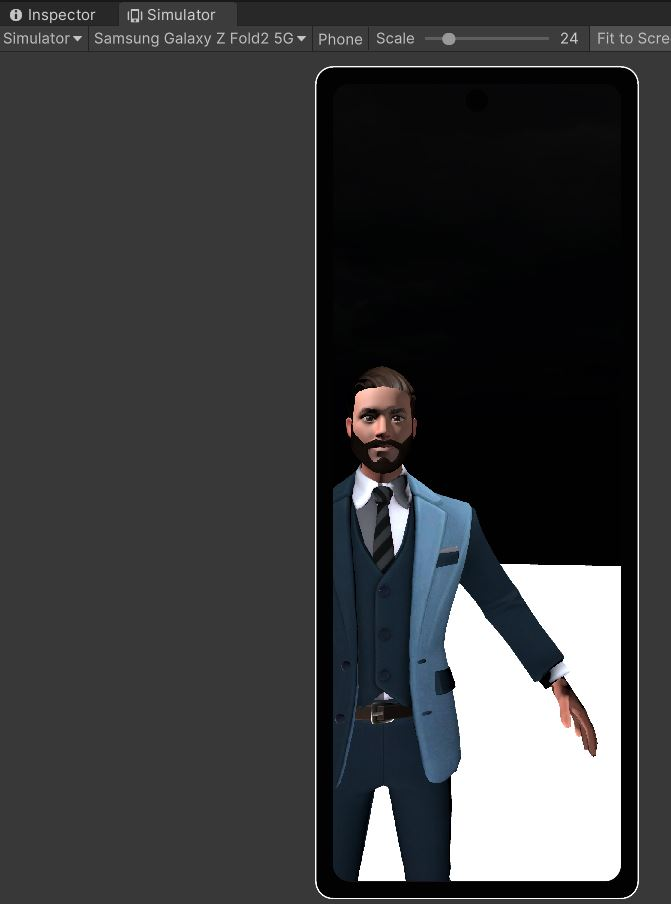

# UnityAvatarForAndroid

Welcome to **UnityAvatarForAndroid**!

This APK is a prototype that demonstrates an interactive user interface featuring a rigged avatar. Developed with the Unity Game Engine, it includes a Simulator package to ensure compatibility across various Android devices. The avatar was designed using the Ready Player Me package, providing a customizable and engaging user experience.

Feel free to download the `Avatar.apk` file and try it out in your cellphone.

## Demo

Explore the prototype with the images and video below:

> **Note:** This is an early prototype. Future versions will aim to enhance functionality and introduce additional features.

---

Feel free to provide any feedback or suggestions for improvements!
